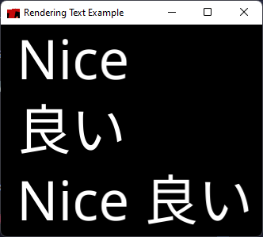

# Macroquad Font Renderer

A Simple way to draw text in macroquad with support of using glyphs
from multiple fonts in a single draw_text call, also known as fallback fonts

I made this because the one provided by macroquad doesn't support this

## Example
From [render_text](examples/render_text.rs) example


```rust
use macroquad::prelude::*;

use macroquad_font_renderer::Fonts;

const NOTO_SANS: &[u8] = include_bytes!("../assets/fonts/NotoSans-Regular.ttf");
const NOTO_SANS_JP: &[u8] = include_bytes!("../assets/fonts/NotoSansJP-Regular.otf");

fn window_conf() -> Conf {
  Conf {
    window_title: "Rendering Text Example".to_owned(),
    window_width: 330,
    window_height: 267,
    high_dpi: true,
    window_resizable: true,
    ..Default::default()
  }
}

#[macroquad::main(window_conf)]
async fn main() {
  let mut fonts = Fonts::default();
  
  fonts.load_font_from_bytes(NOTO_SANS).unwrap();
  fonts.load_font_from_bytes(NOTO_SANS_JP).unwrap();

  loop {
    fonts.draw_text("Nice", 20.0, 0.0, 69, Color::from([1.0; 4]));
    fonts.draw_text("良い", 20.0, 89.0, 69, Color::from([1.0; 4]));
    fonts.draw_text("Nice 良い", 20.0, 178.0, 69, Color::from([1.0; 4]));

    next_frame().await;
  }
}
